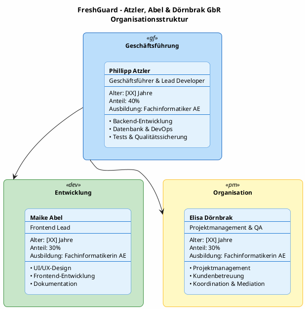
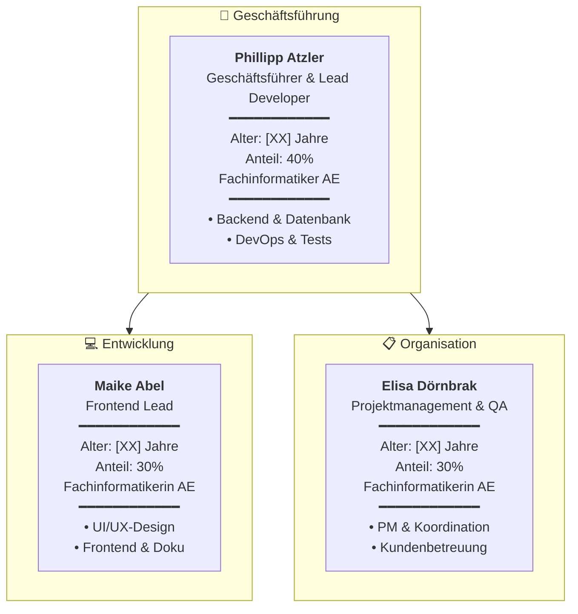

# Organigramm FreshGuard – Atzler, Abel & Dörnbrak GbR

## Organisationsstruktur

## Alternative Darstellung (Mermaid)

Falls PlantUML nicht verfügbar ist, hier die Alternative mit Mermaid:

## Tabellarische Übersicht

| Position | Name | Alter | Anteil | Ausbildung | Verantwortlichkeiten |
|----------|------|-------|--------|------------|---------------------|
| **Geschäftsführer & Lead Developer** | Phillipp Atzler | [XX] Jahre | 40% | Fachinformatiker AE | Backend, Datenbank, DevOps, Tests |
| **Frontend Lead** | Maike Abel | [XX] Jahre | 30% | Fachinformatikerin AE | UI/UX-Design, Frontend, Dokumentation |
| **Projektmanagement & QA** | Elisa Dörnbrak | [XX] Jahre | 30% | Fachinformatikerin AE | PM, Kundenbetreuung, Koordination, Mediation |

---

## Hinweise

⚠️ **Bitte ersetzen Sie `[XX]` durch das tatsächliche Alter der Gründer.**

### Vertretungsregelung
Bei Abwesenheit eines Gründers übernehmen die anderen beiden dessen Aufgaben. Kritische Zugangsdaten sind bei allen Gesellschaftern hinterlegt.

### Entscheidungsstruktur
- **Geschäftsführung:** Phillipp Atzler (alleinvertretungsberechtigt)
- **Wichtige Entscheidungen:** Zweidrittel-Mehrheit erforderlich
- **Mediation bei Konflikten:** Elisa Dörnbrak
